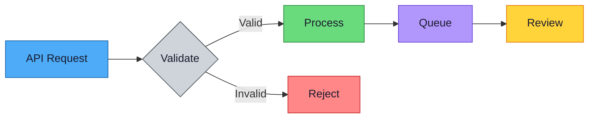

# Azure Logic App SFI Demo — Copilot Instructions

<!-- This file provides AI coding assistant instructions for this project. -->

## Project Overview

<!-- Describe what the project does, its architecture, and tech stack. -->

## Project Structure

<!-- Document key directories and files. -->

## Security

- Do not commit secrets, credentials, API keys, or connection strings to source control.
- Use managed identity, Key Vault, or environment variables for secrets management.
- Use `.gitignore` to exclude sensitive files.
- All test data must be synthetic — never use real PII or PHI.

## License Headers

Include an [SPDX license identifier](https://spdx.dev/learn/handling-license-info/) at the top of every source file to make the license machine-readable and unambiguous.

| Language | Format |
|---|---|
| Bicep, TypeScript, JavaScript | `// SPDX-License-Identifier: MIT` |
| PowerShell, Python, YAML | `# SPDX-License-Identifier: MIT` |
| HTML, Markdown | `<!-- SPDX-License-Identifier: MIT -->` |

Replace `MIT` with the project's license from the [SPDX License List](https://spdx.org/licenses/) (e.g., `Apache-2.0`, `BSD-3-Clause`). The identifier must match the `LICENSE` file in the repo root.

Preserve existing license headers when editing files.

## Repository Visibility

All new repositories MUST be created as **private** by default. A repository may only be made public after completing the public readiness checklist below.

### Required Files (All Projects)

Every project must include these files from the start:

| File | Purpose |
|---|---|
| `README.md` | Project overview, setup, usage |
| `LICENSE` | License terms (e.g., MIT). Required before going public. |
| `.gitignore` | Exclude secrets, build artifacts, IDE files, venvs |
| `.github/copilot-instructions.md` | AI coding assistant instructions |

### Additional Files (Before Going Public)

| File | Purpose |
|---|---|
| `DISCLAIMER.md` | "Proof-of-concept, AS-IS, no SLAs" disclaimer (if applicable) |
| `CONTRIBUTING.md` | How to contribute, code style, CI requirements |
| `SECURITY.md` | How to report vulnerabilities |

### Pre-Public Readiness Checklist

Before changing a repository from private to public, verify ALL of the following:

**Client & Data Anonymity**
- [ ] No client names, project codenames, or internal identifiers in any file
- [ ] No real email addresses or domains — use placeholders (e.g., `admin@contoso.com`)
- [ ] No internal URLs, Jira/ADO ticket numbers, or internal wiki links
- [ ] No real PII/PHI in test data, comments, or commit history
- [ ] Run: `git log --all --oneline | Select-String "client-name"` and `Select-String -Path * -Pattern "client-name" -Recurse` to verify

**Security**
- [ ] No secrets, credentials, or connection strings in code or commit history
- [ ] Credential scanning (gitleaks) passes on full history: `gitleaks detect --source . -v`
- [ ] No `local.settings.json`, `.env` files, or other secret-containing files committed
- [ ] Authentication uses OIDC federated credentials or managed identity — no stored service principal secrets

**Legal & Documentation**
- [ ] `LICENSE` file exists with appropriate license (e.g., MIT)
- [ ] `DISCLAIMER.md` exists if the project is a POC/demo/reference implementation
- [ ] `CONTRIBUTING.md` exists with code style and CI requirements
- [ ] README includes a disclaimer/notice if not production-supported
- [ ] No "Classification: Internal" or "Private — All rights reserved" markers
- [ ] SPDX license identifiers in source files match the LICENSE file

**Code Quality**
- [ ] All tests passing
- [ ] All linting and formatting checks passing
- [ ] CI pipeline is green
- [ ] No TODO/FIXME comments referencing internal context
- [ ] README accurately describes current state

**Commit History**
- [ ] No secrets ever committed (even if later deleted — they persist in git history)
- [ ] No large binary files that shouldn't be public
- [ ] If history contains sensitive data, consider squashing or starting fresh with `git checkout --orphan`

**Demo/POC Projects (Additional)**
- [ ] `DISCLAIMER.md` exists stating the project is a POC/reference implementation, not a supported product
- [ ] README includes a prominent disclaimer notice at the top (e.g., "> **Note:** This is a proof-of-concept, not a supported product.")
- [ ] All test/sample data is synthetic — validated by searching for real names, emails, patient IDs
- [ ] No production endpoints, subscription IDs, or tenant IDs in committed files
- [ ] Support scope is clear: "provided AS-IS, no SLAs, no warranties"

## CI Requirements

- All PRs must pass CI before merge.
- Credential/secret scanning (e.g., gitleaks, GitHub secret scanning) must pass — no secrets may be committed.
- All linting checks must pass (language-specific linter listed in type-specific template).
- All tests must pass.
- Document specific CI checks in this section for your project.

## Testing

- Always run tests after making changes.
- Fix any test failures before committing.
- Prefer high-value tests over percentage coverage.
- Document how to run tests in this section.

## Naming Conventions

<!-- Document your project's naming conventions here. Be specific about casing (camelCase, PascalCase, snake_case, kebab-case) and naming patterns for files, variables, functions, and resources. -->

## Git Workflow

### Commit Messages

Follow [Conventional Commits](https://www.conventionalcommits.org/) format:

```
<type>(<scope>): <short summary>
```

| Type | Use When |
|---|---|
| `feat` | Adding a new feature |
| `fix` | Fixing a bug |
| `docs` | Documentation changes only |
| `test` | Adding or updating tests |
| `refactor` | Code changes that don't fix bugs or add features |
| `chore` | Maintenance tasks (dependencies, CI config) |
| `ci` | CI/CD pipeline changes |

### Branch Naming

Use descriptive prefixes: `feature/`, `bugfix/`, `infra/`, `docs/`, `refactor/`

Example: `feature/add-user-auth`, `bugfix/fix-null-pointer`, `infra/add-monitoring`

## Dependency Management

- Commit lock files (`package-lock.json`, `yarn.lock`, `requirements.txt`, `.terraform.lock.hcl`).
- Enable automated dependency updates (GitHub Dependabot or Renovate) for security patches.
- Review and test dependency updates before merging — do not auto-merge major version bumps.
- Pin direct dependencies to specific versions in production projects.
- Regularly audit for known vulnerabilities: `npm audit`, `pip audit`, `snyk test`.

## Error Handling

- Use try/catch for async operations and external API calls.
- Exit with non-zero code on failures in scripts.
- Check prerequisites before operations.
- Log errors with contextual information.

## Documentation

- Keep README.md in root for project overview.
- Place detailed docs in a `docs/` folder.
- Update documentation when making related code changes.

## Diagrams

### Mermaid

- Use Mermaid syntax for architecture and flow diagrams in markdown.
- Do NOT use `<br>` or literal `\n` inside Mermaid node labels — they render inconsistently across GitHub, VS Code, and other renderers. Use short single-line labels or split content across multiple connected nodes.

```mermaid
%% BAD
A["Source system\nEvent"]

%% GOOD
A[Source system] -.-> A2[Event]
```

### Accessibility (WCAG 2.1 AA)

All diagrams — Mermaid, Excalidraw, and exported images — must meet WCAG 2.1 AA standards:

- **Color contrast** — Text and meaningful graphical elements must have a contrast ratio of at least **4.5:1** against their background.
- **No color-only meaning** — Convey meaning with labels, shapes, or patterns in addition to color. For example, use edge labels ("High", "Normal") not just colored paths.
- **Alt text** — When embedding diagram images (PNG/SVG exports), always include descriptive `alt` text.
- **Font size** — Use a minimum of 12px in Excalidraw and other visual diagram tools.

### Standard Dual-Mode Palette

Use this palette for all Mermaid diagrams. Every color is WCAG AA compliant (≥4.5:1 text contrast) and visible on both light and dark backgrounds.

| Role | Fill | Stroke | Text | Use For |
|---|---|---|---|---|
| **Primary** | `#4dabf7` | `#1864ab` | `#1a1a2e` | Main flow, default nodes |
| **Success** | `#69db7c` | `#2b8a3e` | `#1a1a2e` | Completed, healthy, valid |
| **Warning** | `#ffd43b` | `#e67700` | `#1a1a2e` | Caution, pending review |
| **Danger** | `#ff8787` | `#c92a2a` | `#1a1a2e` | Errors, critical, blocked |
| **Info** | `#b197fc` | `#6741d9` | `#1a1a2e` | Metadata, supporting info |
| **Neutral** | `#ced4da` | `#495057` | `#1a1a2e` | Background, inactive, optional |

Copy this `classDef` block into your Mermaid diagrams:



Do **not** use `%%{init: {'theme': 'base', ...}}%%` directives — they force a light background and break dark mode rendering on GitHub and VS Code. The `classDef` approach above works on both light and dark backgrounds without any init block.

Do **not** use: `fill:#4472C4,color:#fff` (fails contrast), `fill:#dbeafe` (invisible on dark), or `fill:#1e1e1e` (invisible on dark).

## Verification

- Run linting, build, and tests after making changes.
- Validate changes don't break existing behavior.
- For infrastructure changes, use preview/what-if commands before deploying.

## Common Pitfalls

<!-- Document hard-won lessons, deployment gotchas, and non-obvious issues here. This section grows over time as the team encounters problems. Examples: -->
<!-- - "Key Vault names are globally unique and limited to 24 characters" -->
<!-- - "CDN caches old JS bundles — purge after every SPA deploy" -->
<!-- - "The Fabric API requires language_info.name in notebook metadata" -->

## Secure Future Initiative (SFI) Alignment

All code must align with [Microsoft's Secure Future Initiative](https://www.microsoft.com/en-us/trust-center/security/secure-future-initiative) principles: **Secure by Design**, **Secure by Default**, and **Secure Operations**.

### Identity & Secrets

- Use managed identity or workload identity federation — never stored service principal secrets.
- Enforce phishing-resistant MFA for all human access to production systems.
- Rotate secrets automatically; never rely on manual rotation schedules.
- Use short-lived tokens over long-lived credentials wherever possible.
- Store secrets in Key Vault or equivalent secret store — never in code, config files, or environment variables baked into images.

### Engineering Systems (Secure SDLC)

- All CI/CD pipelines must include: credential scanning, dependency vulnerability scanning, and SPDX SBOM generation.
- Pin dependencies to exact versions and audit regularly (`npm audit`, `pip audit`, `snyk test`).
- Use compliance gates in pipelines — builds must fail on high/critical vulnerabilities.
- Maintain a Software Bill of Materials (SBOM) for every release artifact.
- Code reviews must include a security lens — reviewers should check for injection, auth bypass, and data exposure.

### Network & Isolation

- Follow Zero Trust principles: verify explicitly, use least privilege, assume breach.
- Use private endpoints for Azure services — no public endpoints in production.
- Segment environments (dev/staging/prod) with separate identities and network boundaries.
- Never allow lateral movement between tenants or environments by sharing credentials.

### Monitoring, Detection & Response

- Centralize security logs — all services must emit structured logs to a SIEM or central log store.
- Enable diagnostic settings and audit logging for all Azure resources.
- Set up alerts for anomalous access patterns, failed auth attempts, and privilege escalation.
- Maintain an incident response runbook in `docs/` or the project wiki.

### Vulnerability Management

- Remediate critical vulnerabilities within SLA (critical: 24h, high: 7d, medium: 30d).
- Enable GitHub Dependabot or Renovate for automated dependency updates.
- Track known vulnerabilities in issues with the `security` label.
- Run SAST/DAST scans in CI — do not merge PRs with unresolved high/critical findings.

### Secure by Default Checklist

When creating new services or resources:
- [ ] Authentication is required — no anonymous access unless explicitly justified
- [ ] HTTPS/TLS enforced — no plaintext transport
- [ ] Least-privilege RBAC roles assigned — no Owner/Contributor unless required
- [ ] Logging and monitoring enabled from day one
- [ ] Private networking configured — public access disabled where possible
- [ ] Secrets stored in Key Vault with access policies scoped to specific identities

## Do NOT

- Do not commit secrets or credentials.
- Do not use real PII/PHI in test data.
- Do not skip CI checks.
- Do not make changes without running tests.
- Do not make a repository public without completing the pre-public readiness checklist.
- Do not commit internal identifiers, client names, or real email addresses.
- Do not merge without following Conventional Commits format.
- Do not use color alone to convey meaning in diagrams — add labels or shapes.
- Do not commit without an SPDX license identifier in new source files.
- Do not use stored service principal secrets — use managed identity or workload identity federation.
- Do not expose Azure services on public endpoints in production — use private endpoints.
- Do not deploy without an SBOM and passing vulnerability scans.
- Do not skip security logging — all services must emit audit logs from day one.
- Do not grant Owner or Contributor roles when a scoped custom role or built-in reader/operator role suffices.

---

# Azure Bicep + PowerShell — Copilot Instructions

> Append this to the base `copilot-instructions.md` for Azure Bicep IaC projects.

## SFI Alignment (Secure Future Initiative)

Azure infrastructure projects should align with Microsoft's [Secure Future Initiative](https://www.microsoft.com/en-us/security/blog/secure-future-initiative/) principles:

| Principle | Implementation |
|---|---|
| **Protect identities and secrets** | No credentials or keys in source control. Use Managed Identity and Key Vault. API connectors authorized interactively or via federated credentials. Disable shared key access on storage accounts (`allowSharedKeyAccess: false`). |
| **Protect tenants and isolate production** | Deploy to isolated resource groups. No cross-tenant or cross-environment references in non-production code. |
| **Protect networks** | Disable public blob access (`allowBlobPublicAccess: false`). Enforce TLS 1.2 minimum. Use private endpoints where feasible. |
| **Protect engineering systems** | All changes through CI with credential scanning. Use OIDC federated credentials for deployment — no stored service principal secrets. |
| **Monitor and detect threats** | Route diagnostic logs to Log Analytics. Enable diagnostic settings on all resources that support them. |
| **Accelerate response** | Include teardown/cleanup scripts for rapid environment decommissioning. |

When modifying infrastructure or scripts, verify changes maintain these properties.

## Bicep Conventions

### Module Interface Pattern

Standard parameter triplet that most modules should accept:

```bicep
@description('Azure region for resources')
param location string

@description('Base name for resources')
param baseName string

@description('Resource tags')
param tags object
```

**Exceptions:** Control-plane-only modules (role assignments, diagnostics) may omit `location` and `tags`.

### Naming Convention

- All resource names follow: `${baseName}-<suffix>`
- Use descriptive suffixes per resource type (e.g., `-law` for Log Analytics, `-kv` for Key Vault, `-plan` for App Service Plan, `-func` for Function App, `-logic` for Logic App, `-cr` for Container Registry, `-aks` for AKS)
- Construct `baseName` in the main orchestrator file using project prefix + environment + unique identifier (e.g., `var baseName = '{projectName}-${environment}-${uniqueSuffix}'`)

### Decorators

- Every parameter and output **MUST** have a `@description()` decorator
- Use `@secure()` for sensitive values (connection strings, keys, passwords)
- Use `@allowed()` for constrained parameter values (e.g., SKU tiers, environment names)
- Use `@minLength()` / `@maxLength()` where input validation is appropriate

### Tags

- Pass `tags` object to every module that creates Azure resources
- Apply tags at the top-level resource only (not child resources)
- Control-plane-only modules do **NOT** accept tags

### Variables

- Use variables for resource names: `var resourceName = '${baseName}-suffix'`
- Use variables for role definition GUIDs — never inline magic strings
- Use variables to precompute complex expressions used in multiple places

### `existing` Keyword

- Use `existing` to reference resources created by other modules
- Avoids circular dependencies and keeps modules loosely coupled
- Prefer `existing` over passing full resource objects between modules

### Role Assignments

- Use `guid(scopeResourceId, principalId, roleDefinitionId)` for deterministic, idempotent names
- Scope to the specific resource, not the resource group, unless the role logically applies group-wide
- Centralize role assignments in a dedicated `role-assignments.bicep` module

### Identity Pattern

- Use `SystemAssigned` managed identity for compute resources (Logic Apps, Functions, Container Apps, AKS)
- Use `ManagedServiceIdentity` auth type for API connections
- Use RBAC authorization mode for Key Vault (`enableRbacAuthorization: true`) — not access policies
- Disable shared key access on storage accounts: `allowSharedKeyAccess: false`. Always use Entra ID (RBAC) for storage authentication.
- Pass `principalId` outputs from compute modules into the role-assignments module

### MCAPS Tenant: `SecurityControl=Ignore` Tag

In MCAPS (Microsoft Corp tenant) subscriptions, Azure Policy enforces security controls that may block deployments — for example, requiring `allowSharedKeyAccess: false` on storage accounts. If a deployment fails due to policy, **fix the root cause first** (switch to managed identity + RBAC).

The `SecurityControl=Ignore` tag can **temporarily bypass** MCAPS policy enforcement, but only under strict conditions:

```bicep
// ⚠️ TEMPORARY: Bypass MCAPS policy to diagnose identity/RBAC issue
// Ticket: [link to investigation ticket]
// Owner: [your alias]
// Remove by: [date, max 48 hours]
resource storageAccount 'Microsoft.Storage/storageAccounts@2023-05-01' = {
  name: storageAccountName
  location: location
  tags: union(tags, {
    SecurityControl: 'Ignore'
  })
  properties: {
    allowSharedKeyAccess: true  // TEMPORARY — revert after diagnosis
  }
}
```

**Rules for using `SecurityControl=Ignore`:**
- ✅ **Only** for short-term debugging to validate identity/RBAC propagation issues
- ✅ **Must** include a comment block with: reason, owner, ticket link, and removal date (max 48 hours)
- ✅ **Must** be documented in the project README or a `docs/security-exceptions.md` file
- ✅ **Must** be reverted in the same PR or a follow-up PR linked in the original
- ❌ **Never** merge to `main` with this tag — use a feature branch only
- ❌ **Never** use as a permanent workaround — always fix the underlying identity/RBAC issue
- ❌ **Never** use in production subscriptions

### Dependency Wiring

- Modules communicate via outputs → parameters in the main orchestrator
- Use `dependsOn` only when there is no implicit dependency through parameter references
- Order module declarations in the orchestrator to reflect logical deployment sequence

### Entra RBAC Propagation

ARM and Bicep cannot model Entra ID RBAC propagation timing. Role assignments (e.g., `AcrPull`, `Storage Blob Data Contributor`) take **up to 10 minutes** to propagate after creation. Resources that depend on those roles (Container Apps pulling from ACR, Functions reading from storage) will fail if they deploy before propagation completes.

**Use staged deployments** to solve this:

```powershell
# Stage 1: Deploy identity + role assignments
az deployment group create --template-file main.bicep --parameters stage='identity'

# Wait for RBAC propagation
Write-Host "Waiting for RBAC propagation..." -ForegroundColor Yellow
Start-Sleep -Seconds 120

# Stage 2: Deploy workloads that depend on the roles
az deployment group create --template-file main.bicep --parameters stage='workload'
```

Or use a single template with deployment scripts that include a retry/wait loop:

```bicep
// dependsOn does NOT guarantee RBAC propagation — only that the assignment resource was created
resource containerApp 'Microsoft.App/containerApps@2024-03-01' = {
  dependsOn: [acrPullRole]  // Role created, but may not be propagated yet
  // ...
}
```

**Key rules:**
- Never assume a role assignment is effective immediately after `dependsOn`
- For CI/CD, add a wait step (60–120s) between role assignment and workload deployment
- For first-time deployments, expect the workload to fail once — redeploy after propagation
- Document staged deployment order in your `deploy.ps1` script

### Diagnostic Settings

All resources that support diagnostics should follow this pattern:

```bicep
resource diag 'Microsoft.Insights/diagnosticSettings@2021-05-01-preview' = {
  name: 'send-to-law'
  scope: existingResource
  properties: {
    workspaceId: workspaceId
    logs: [
      {
        category: '{logCategory}'
        enabled: true
      }
    ]
    metrics: [
      {
        category: 'AllMetrics'
        enabled: true
      }
    ]
  }
}
```

## PowerShell Conventions

### Script Structure

- Use `param()` block at the top with typed, defaulted parameters
- Set `$ErrorActionPreference = "Stop"` at the top of every script
- Use numbered progress sections: `[1/N] Step description...`
- Use color-coded output:
  - **Yellow** = in progress
  - **Green** = success
  - **Red** = error
  - **Gray** = detail / verbose info
  - **Cyan** = section headers

### Azure CLI Usage

- Use `az` CLI (not Az PowerShell cmdlets) for resource operations
- Always check `$LASTEXITCODE` after `az` commands
- Parse JSON output with `ConvertFrom-Json`
- Use `--output json` when parsing results, `--output none` when no output is needed
- Use `--only-show-errors` to suppress warnings when appropriate

### Error Handling

- Check prerequisites before operations (Azure login, required tools, CLI versions)
- Exit with code `1` on any failure
- Use `try/catch` for REST API calls (`Invoke-RestMethod`)
- Provide clear error messages indicating what failed and what to do about it

## Bicep Validation

**Always run `az bicep build` after modifying any `.bicep` file.** This catches syntax errors, type mismatches, and missing parameters before deployment.

```powershell
# Validate a single file
az bicep build --file main.bicep

# Validate all .bicep files in the project
Get-ChildItem -Recurse -Filter *.bicep | ForEach-Object {
    Write-Host "Validating $($_.Name)..." -ForegroundColor Cyan
    az bicep build --file $_.FullName --stdout | Out-Null
    if ($LASTEXITCODE -ne 0) { Write-Host "FAILED: $($_.FullName)" -ForegroundColor Red }
}
```

### Pre-Commit Hook

Install a git pre-commit hook to automatically validate Bicep files before every commit. Create `.git/hooks/pre-commit`:

```bash
#!/bin/sh
# Pre-commit hook: validate all staged .bicep files with az bicep build

staged_bicep=$(git diff --cached --name-only --diff-filter=ACM | grep '\.bicep$' || true)

if [ -z "$staged_bicep" ]; then
  exit 0
fi

echo "Validating Bicep files..."
failed=0

for file in $staged_bicep; do
  if ! az bicep build --file "$file" --stdout > /dev/null 2>&1; then
    echo "  FAILED: $file"
    failed=1
  else
    echo "  OK: $file"
  fi
done

if [ $failed -ne 0 ]; then
  echo ""
  echo "Bicep validation failed. Fix errors before committing."
  exit 1
fi
```

To install the hook in an existing project, run:

```powershell
# PowerShell one-liner to install the Bicep pre-commit hook
$hookPath = ".git\hooks\pre-commit"
if (-not (Test-Path $hookPath)) {
    $hookUrl = "https://raw.githubusercontent.com/michaelhuot-msft/copilot-instructions-templates/main/hooks/pre-commit-bicep"
    Invoke-WebRequest -Uri $hookUrl -OutFile $hookPath
    Write-Host "Bicep pre-commit hook installed." -ForegroundColor Green
} else {
    Write-Host "Pre-commit hook already exists — merge manually." -ForegroundColor Yellow
}
```

## Adding New Resources — Checklist

1. Create a module in `modules/{resource}.bicep` accepting `location`, `baseName`, `tags`
2. Follow naming: `var resourceName = '${baseName}-<suffix>'`
3. Add `@description()` to all parameters and outputs
4. Use managed identity if the resource supports it (`SystemAssigned`)
5. Wire in main orchestrator: add module call in dependency order
6. Add RBAC in `role-assignments` module if the resource needs identity-based access
7. Add diagnostics (reference via `existing`, add diagnostic setting)
8. Update deployment script validation if needed

## Deployment Validation

Always preview infrastructure changes before deploying:

```powershell
# What-if deployment preview — surfaces breaking changes before they happen
az deployment group what-if `
  --resource-group $resourceGroup `
  --template-file main.bicep `
  --parameters parameters/dev.bicepparam
```

### Container / Image Deployments

- **Verify images exist in ACR** before deploying Container Apps — first deployment will fail if images aren't pushed yet.
- **Use unique image tags** (e.g., git SHA or build number), not just `latest` — Container Apps caches `latest` and won't pull a new image.
- **Use `--revision-suffix`** with `az containerapp update` to force a new image pull.
- **Purge CDN cache** after deploying a new SPA image: `az afd endpoint purge --content-paths "/*"`.

### Post-Deployment Verification

- Check resource provisioning state in the deployment output.
- Validate key resources exist: `az resource list --resource-group $rg --output table`.
- Run smoke tests or health checks against deployed endpoints.

## Do NOT (Bicep-Specific)

- Do not use access policies for Key Vault — use RBAC authorization mode
- Do not enable shared key access on storage accounts — set `allowSharedKeyAccess: false` and use Managed Identity with RBAC (e.g., Storage Blob Data Contributor)
- Do not store credentials in code — use Managed Identity and Key Vault
- Do not use connection strings at runtime — use Managed Identity auth
- Do not use `dependsOn` when parameter references already create implicit dependencies
- Do not create resources outside of Bicep modules — all infrastructure must be defined in modules
- Do not inline role definition GUIDs — store them in variables with descriptive names
- Do not hardcode resource names — always derive from `baseName`
- Do not commit Bicep changes without running `az bicep build` first
- Do not assume `dependsOn` a role assignment means the role is active — RBAC propagation is async and can take minutes
- Do not merge `SecurityControl=Ignore` tags to `main` — use only on feature branches for short-term RBAC debugging, and always revert

---

## Project-Specific Instructions

<!-- Add your project-specific instructions below -->
<!-- Document: architecture, schemas, deployment, environment setup -->