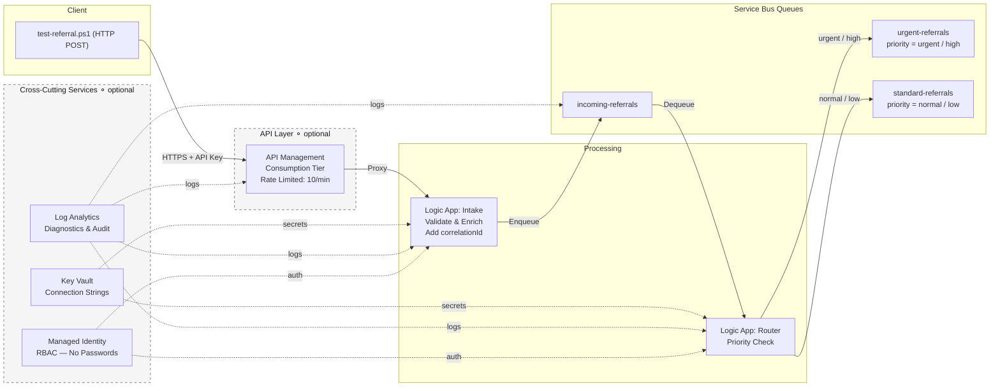
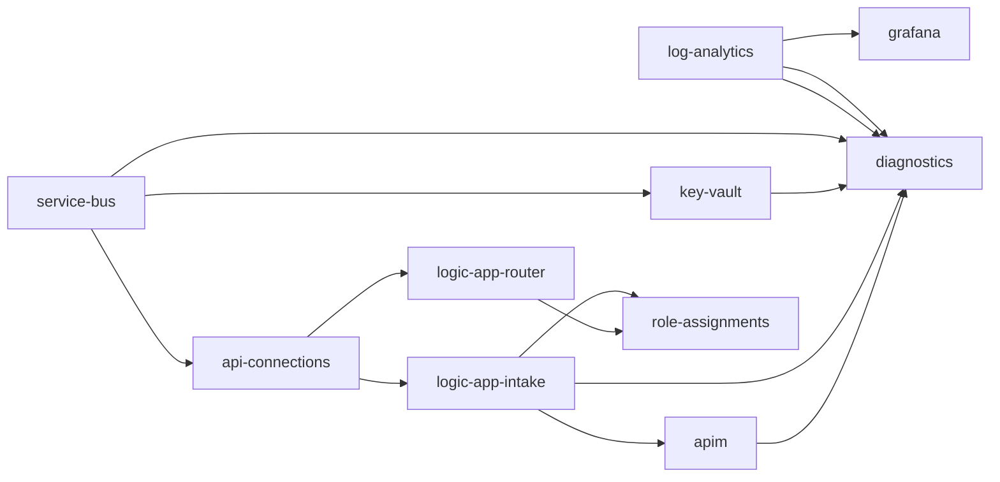

# Azure Logic Apps Healthcare Referral Routing Demo

Automated patient referral intake and priority-based routing using Azure Logic Apps, Service Bus, and API Management — deployed in minutes with Bicep Infrastructure-as-Code.

## Architecture Overview



## Prerequisites

| Requirement | Version | Install |
|-------------|---------|---------|
| Azure CLI | 2.50+ | [Install](https://learn.microsoft.com/en-us/cli/azure/install-azure-cli) |
| Bicep CLI | 0.22+ | `az bicep install` |
| Az PowerShell | 10.0+ | `Install-Module -Name Az -Scope CurrentUser` |
| Azure Subscription | — | With Contributor role on the target subscription |

## Quick Start

```powershell
# 1. Deploy everything (~5-6 minutes)
./deploy.ps1

# 2. Test with synthetic referrals (use values from deploy output)
./test-referral.ps1 -ApiEndpoint "<APIM_ENDPOINT>" -SubscriptionKey "<KEY>"

# 3. Clean up when done
az group delete --name rg-healthcare-referral-demo --yes --no-wait
```

## Project Structure

```
azure-logic-app-demo/
├── main.bicep                          # Orchestrator — calls all modules in dependency order
├── deploy.ps1                          # Deploys infrastructure + validates resources
├── test-referral.ps1                   # Sends 3 synthetic test referrals
├── demo-helper.ps1                     # Pre-demo validation + Portal links + cheat sheet
├── parameters/
│   └── dev.bicepparam                  # Dev environment parameters
├── modules/
│   ├── log-analytics.bicep             # Log Analytics workspace (30-day retention)
│   ├── service-bus.bicep               # Namespace + 3 queues (incoming/urgent/standard)
│   ├── key-vault.bicep                 # Key Vault + Service Bus connection string secret
│   ├── api-connections.bicep           # Service Bus API connection (managed identity)
│   ├── logic-app-intake.bicep          # Intake: HTTP trigger → validate → enrich → enqueue
│   ├── logic-app-router.bicep          # Router: dequeue → priority check → route
│   ├── role-assignments.bicep          # RBAC: SB Data Sender/Receiver + KV Secrets User
│   ├── apim.bicep                      # API Management (Consumption, rate-limited)
│   ├── grafana.bicep                   # Azure Managed Grafana (Standard tier)
│   └── diagnostics.bicep              # Diagnostic settings → Log Analytics
└── docs/
    ├── architecture.excalidraw         # Visual architecture diagram (open in Excalidraw)
    ├── architecture.mermaid            # Mermaid diagram source
    ├── grafana-dashboard.json          # Grafana dashboard definition (auto-imported on deploy)
    └── demo-script.md                  # 15-minute presenter walkthrough
```

## Module Reference

| # | Module | Purpose | Key Outputs |
|---|--------|---------|-------------|
| 1 | `log-analytics.bicep` | Log Analytics workspace for centralized diagnostics | `workspaceId` |
| 2 | `service-bus.bicep` | Service Bus Standard namespace + 3 queues | `namespaceName`, `namespaceId` |
| 3 | `key-vault.bicep` | Key Vault (RBAC-enabled) storing SB connection string | `vaultUri`, `vaultName`, `vaultId` |
| 4 | `api-connections.bicep` | Service Bus API connection with managed identity auth | `connectionId`, `connectionName` |
| 5 | `logic-app-intake.bicep` | HTTP trigger intake workflow with schema validation | `principalId`, `name`, `resourceId` |
| 6 | `logic-app-router.bicep` | Queue-triggered router with priority-based routing | `principalId` |
| 7 | `role-assignments.bicep` | RBAC grants for both Logic App managed identities | — |
| 8 | `apim.bicep` | API Management gateway with subscription key + rate limit | `gatewayUrl`, `referralEndpoint` |
| 9 | `grafana.bicep` | Azure Managed Grafana with Monitoring Reader + Log Analytics Reader roles | `endpoint`, `name` |
| 10 | `diagnostics.bicep` | Diagnostic settings for all resources → Log Analytics | — |

### Deployment Order



## Referral Schema

The intake Logic App validates incoming referrals against this schema:

```json
{
  "patientId": "PT-2025-00142",
  "patientName": "Sarah Mitchell",
  "referralType": "Cardiology",
  "priority": "urgent",
  "diagnosis": {
    "code": "I25.10",
    "description": "Atherosclerotic heart disease of native coronary artery"
  },
  "referringProvider": "Dr. James Wilson, MD - Internal Medicine",
  "notes": "Patient presents with exertional dyspnea and chest tightness."
}
```

| Field | Type | Required | Description |
|-------|------|----------|-------------|
| `patientId` | string | Yes | Patient identifier |
| `patientName` | string | Yes | Patient full name |
| `referralType` | string | Yes | Specialty (e.g., Cardiology, Physical Therapy) |
| `priority` | enum | Yes | `urgent`, `high`, `normal`, or `low` |
| `diagnosis.code` | string | Yes | ICD-10 diagnosis code |
| `diagnosis.description` | string | Yes | Human-readable diagnosis |
| `referringProvider` | string | Yes | Referring provider name and credentials |
| `notes` | string | No | Additional clinical notes |

### Routing Logic

| Priority | Destination Queue | Typical Use Case |
|----------|------------------|------------------|
| `urgent` | `urgent-referrals` | Immediate specialist evaluation needed |
| `high` | `urgent-referrals` | Expedited review within 48 hours |
| `normal` | `standard-referrals` | Routine specialist referral |
| `low` | `standard-referrals` | Elective or follow-up referral |

### Enrichment

The intake Logic App adds these fields before queuing:

| Field | Value | Purpose |
|-------|-------|---------|
| `correlationId` | UUID (GUID) | End-to-end tracking across both Logic Apps |
| `receivedAt` | ISO 8601 timestamp | Audit trail |
| `status` | `"received"` | Workflow state tracking |

## Security & Compliance

This architecture implements security controls aligned with HIPAA requirements:

| Control | Implementation | Benefit |
|---------|---------------|---------|
| **No stored credentials** | Managed Identity + RBAC on all resources | Eliminates password sprawl and rotation burden |
| **Least privilege** | Separate SB Data Sender / Receiver roles per Logic App | Each identity can only perform its specific operations |
| **Secrets management** | Key Vault with RBAC authorization | Centralized, auditable secret storage |
| **API security** | APIM subscription key + rate limiting (10 req/min) | Prevents unauthorized access and abuse |
| **Audit logging** | All resources send diagnostics to Log Analytics | Full audit trail for compliance reporting |
| **Encryption** | TLS in transit, Azure-managed keys at rest | Data protected at every layer |
| **No real PHI** | All test data is synthetic | Safe for demos and development |

### RBAC Role Assignments

| Identity | Role | Scope | Purpose |
|----------|------|-------|---------|
| Intake Logic App | Azure Service Bus Data Sender | Service Bus Namespace | Send messages to incoming queue |
| Intake Logic App | Key Vault Secrets User | Key Vault | Read connection string secret |
| Router Logic App | Azure Service Bus Data Receiver | Service Bus Namespace | Read messages from incoming queue |
| Router Logic App | Azure Service Bus Data Sender | Service Bus Namespace | Send messages to urgent/standard queues |
| Router Logic App | Key Vault Secrets User | Key Vault | Read connection string secret |

## Cost Estimate

All resources use consumption or low-cost tiers suitable for demos:

| Resource | Tier | Estimated Monthly Cost |
|----------|------|----------------------|
| API Management | Consumption | ~$3.50/million calls |
| Logic Apps (2x) | Consumption | ~$0.000025/action |
| Service Bus | Standard | ~$10/month base |
| Key Vault | Standard | ~$0.03/10K operations |
| Log Analytics | Pay-per-GB | ~$2.76/GB ingested |
| Managed Grafana | Standard | ~$0.05/hour (~$36/month) |

**Estimated total for demo usage**: < $50/month (tear down after demo to minimize cost).

## Observability

### Grafana Dashboard

The deployment includes an **Azure Managed Grafana** instance (Standard tier) with a pre-built dashboard that visualizes the entire referral pipeline in real time. The dashboard is auto-imported during deployment and includes:

| Panel | Type | Data Source |
|-------|------|-------------|
| Total Referrals Received | Stat | Log Analytics (KQL) |
| Urgent Referrals | Stat | Azure Monitor Metrics |
| Standard Referrals | Stat | Azure Monitor Metrics |
| Validation Errors | Stat | Log Analytics (KQL) |
| Intake Logic App Runs | Time series (stacked bar) | Log Analytics (KQL) |
| Router Logic App Runs | Time series (stacked bar) | Log Analytics (KQL) |
| Queue Message Flow | Time series (line) | Azure Monitor Metrics |
| Active Messages per Queue | Bar gauge | Azure Monitor Metrics |
| APIM Requests (Total / Success / Failed) | Time series (line) | Azure Monitor Metrics |
| Recent Referral Activity | Table | Log Analytics (KQL) |

The Grafana URL is shown in `deploy.ps1` output and opened automatically by `demo-helper.ps1`.

To manually import the dashboard: open Grafana > Dashboards > Import > upload `docs/grafana-dashboard.json`.

### Grafana Access (RBAC)

If you see **"No Role Assigned"** in Grafana, your user does not yet have Grafana workspace access.

- `main.bicep` and `modules/grafana.bicep` support an optional `grafanaAdminPrincipalId` parameter.
- `deploy.ps1` now attempts to resolve the signed-in user object ID and passes it into deployment, assigning **Grafana Admin** automatically when possible.
- If automatic resolution is unavailable in your tenant context, grant access manually:

```powershell
$rg = "rg-healthcare-referral-demo"
$userId = az ad signed-in-user show --query id -o tsv
$grafanaId = az resource list -g $rg --resource-type Microsoft.Dashboard/grafana --query "[0].id" -o tsv
az role assignment create --assignee-object-id $userId --assignee-principal-type User --role "Grafana Admin" --scope $grafanaId
```

RBAC propagation can take a few minutes. If needed, refresh Grafana (`Ctrl+F5`) or sign out/in to Azure Portal.

### Which Dashboard to Show in the Demo

Show the imported dashboard titled **Healthcare Referral Routing** (UID: `healthcare-referral-routing`).

Recommended panel order for a short live walkthrough:

1. **Total Referrals Received** (proof that intake is working)
2. **Urgent Referrals** + **Standard Referrals** (proof that routing logic works)
3. **Intake Logic App Runs** + **Router Logic App Runs** (workflow execution visibility)
4. **Queue Message Flow** (end-to-end throughput view)

### Why Not Prometheus or OpenTelemetry?

- **Prometheus** scrapes `/metrics` endpoints on compute workloads (Kubernetes, VMs, containers). All resources here are Azure PaaS with no scrapeable endpoints — Azure Monitor already collects the same metrics natively.
- **OpenTelemetry** requires SDK instrumentation in application code. Logic Apps are a managed no-code service — there's no runtime to instrument. Azure Diagnostic Settings serve the same purpose for PaaS.

### KQL Queries for Log Analytics

**Logic App run history:**
```kql
AzureDiagnostics
| where ResourceProvider == "MICROSOFT.LOGIC"
| where Category == "WorkflowRuntime"
| project TimeGenerated, resource_workflowName_s, status_s, correlation_clientTrackingId_s
| order by TimeGenerated desc
| take 20
```

**Service Bus queue metrics:**
```kql
AzureMetrics
| where ResourceProvider == "MICROSOFT.SERVICEBUS"
| where MetricName == "IncomingMessages" or MetricName == "OutgoingMessages"
| summarize Total=sum(Total) by MetricName, Resource
| order by Resource asc
```

**APIM gateway logs:**
```kql
AzureDiagnostics
| where ResourceProvider == "MICROSOFT.APIMANAGEMENT"
| where Category == "GatewayLogs"
| project TimeGenerated, apiId_s, operationId_s, responseCode_d, callerIpAddress_s
| order by TimeGenerated desc
```

## Cleanup

```powershell
az group delete --name rg-healthcare-referral-demo --yes --no-wait
```

This deletes all resources in the resource group. The `--no-wait` flag returns immediately while deletion continues in the background.

## License

Licensed under the Apache License, Version 2.0. See [LICENSE](LICENSE) for details.
